# SIRH Intelligent — Système d'Information des Ressources Humaines

> Plateforme RH complète avec analyses IA, développée pour ACERFI SARL.  
> Projet de fin d'études — Certification ISA 2026.

**Auteur :** Yemeya Luc  
**Email :** lucyemeya1@gmail.com  
**Entreprise :** ACERFI SARL, Douala, Cameroun

---

## Aperçu

| | |
|---|---|
| 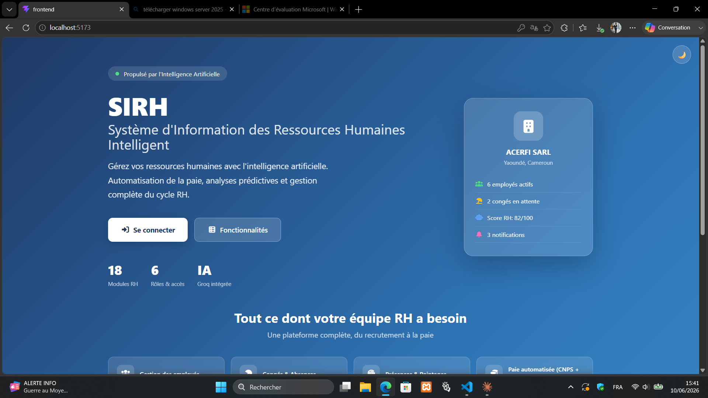 | 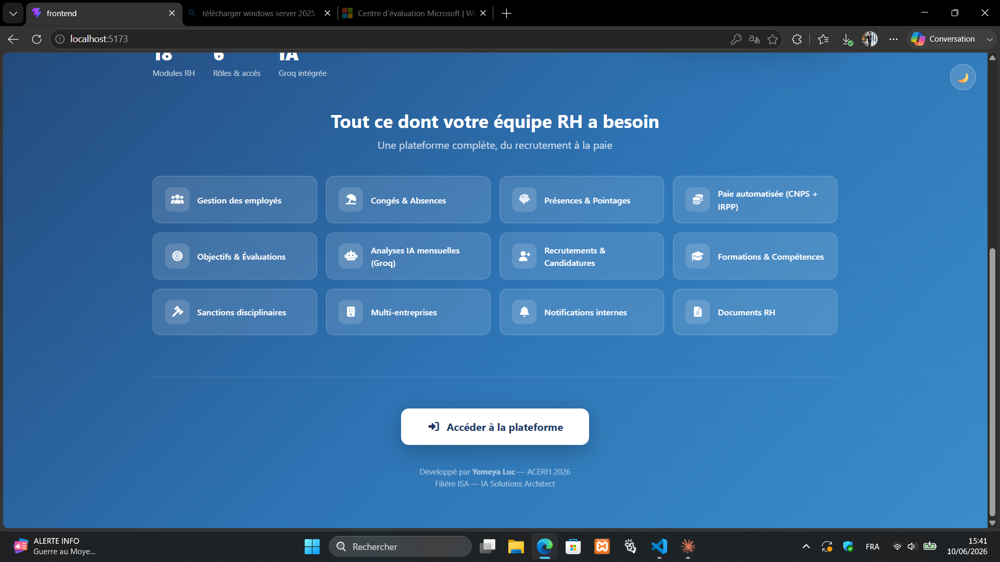 |
| Page d'accueil | 18 modules RH |
| 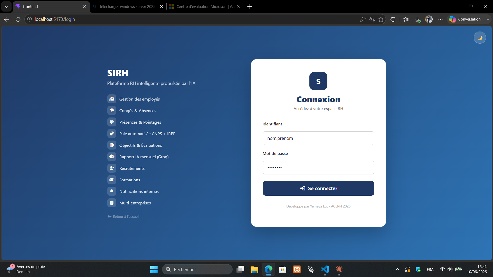 | 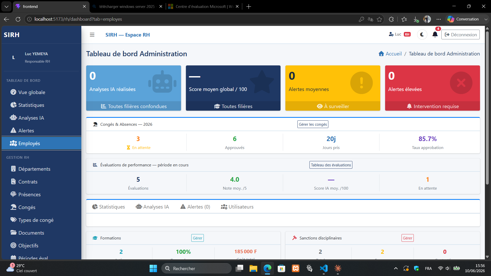 |
| Connexion multi-rôle | Dashboard RH — vue globale |
| 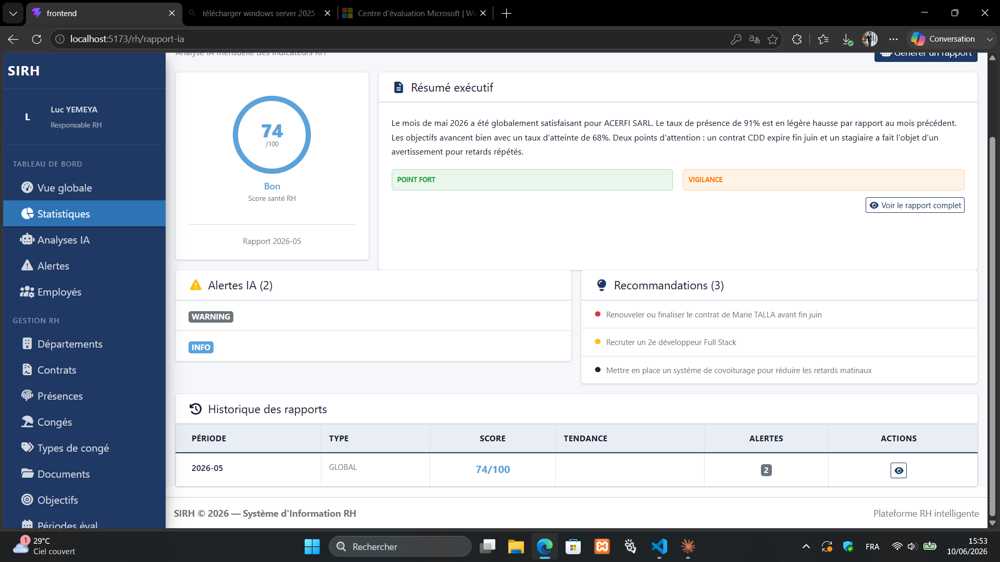 |  |
| Rapport IA Groq — score 74/100 | Historique & recommandations |
| 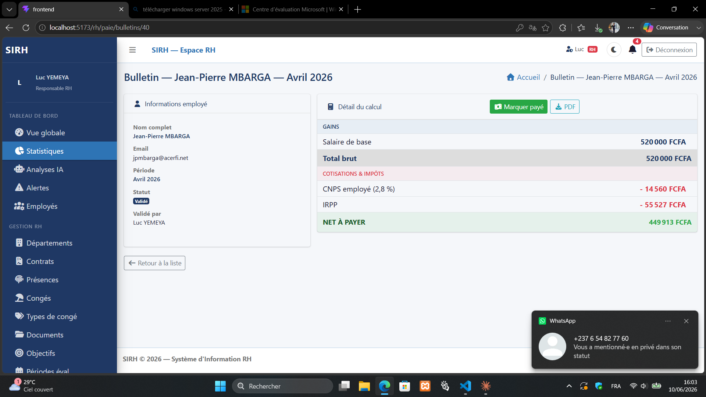 | 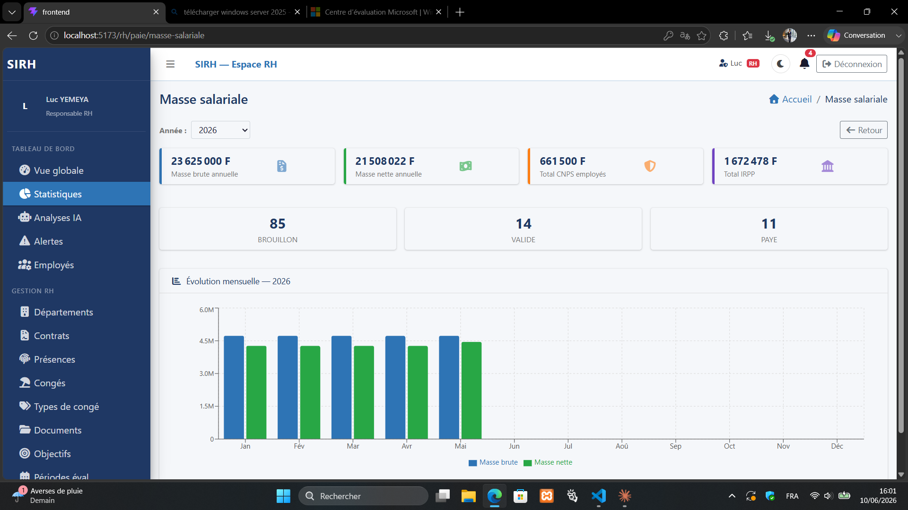 |
| Bulletin de paie (CNPS + IRPP camerounais) | Masse salariale — évolution mensuelle |
| 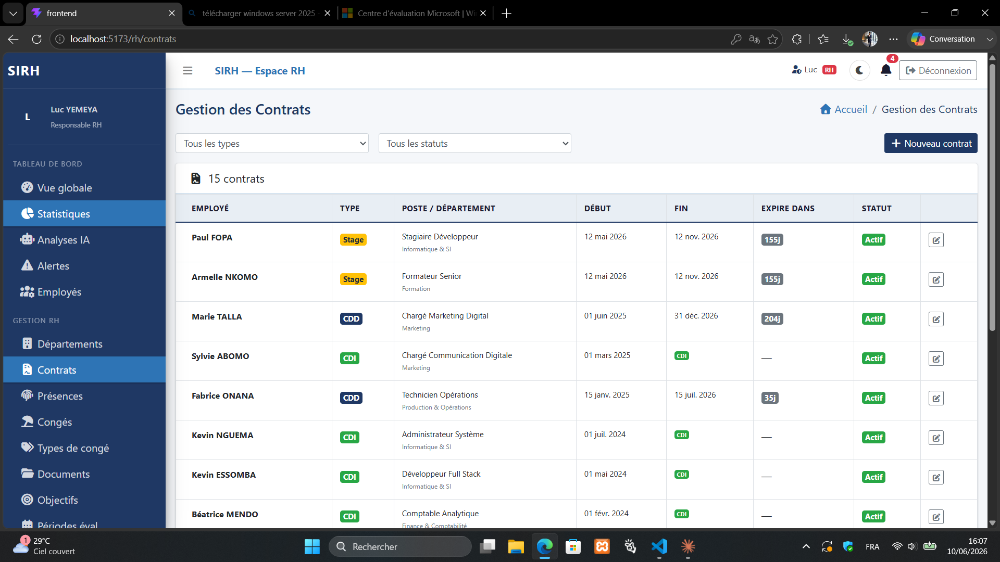 | 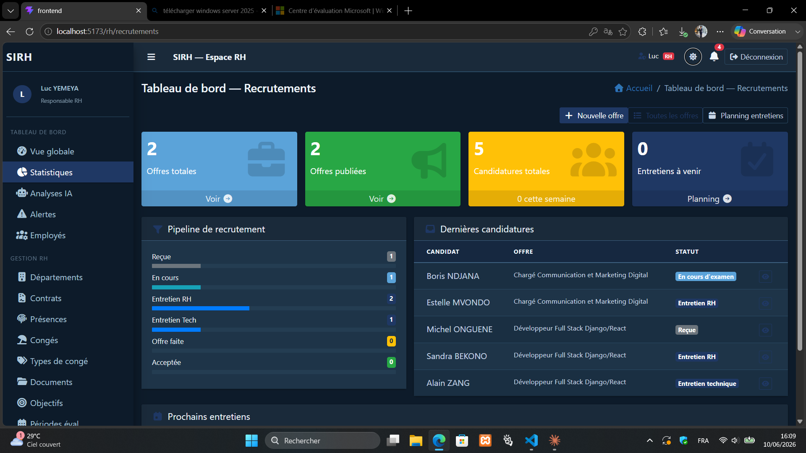 |
| Gestion des contrats | Pipeline de recrutement |
| 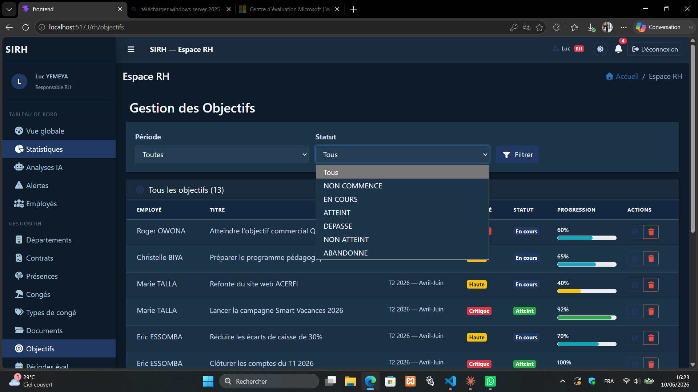 | 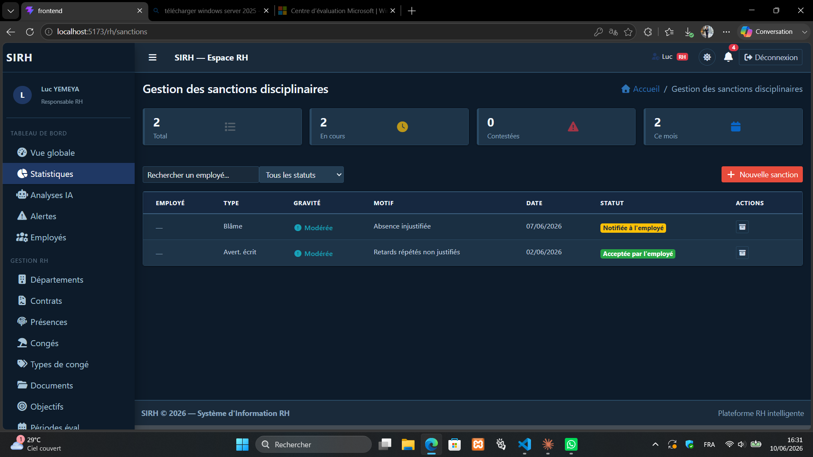 |
| Objectifs & évaluations (mode sombre) | Sanctions disciplinaires (mode sombre) |
| 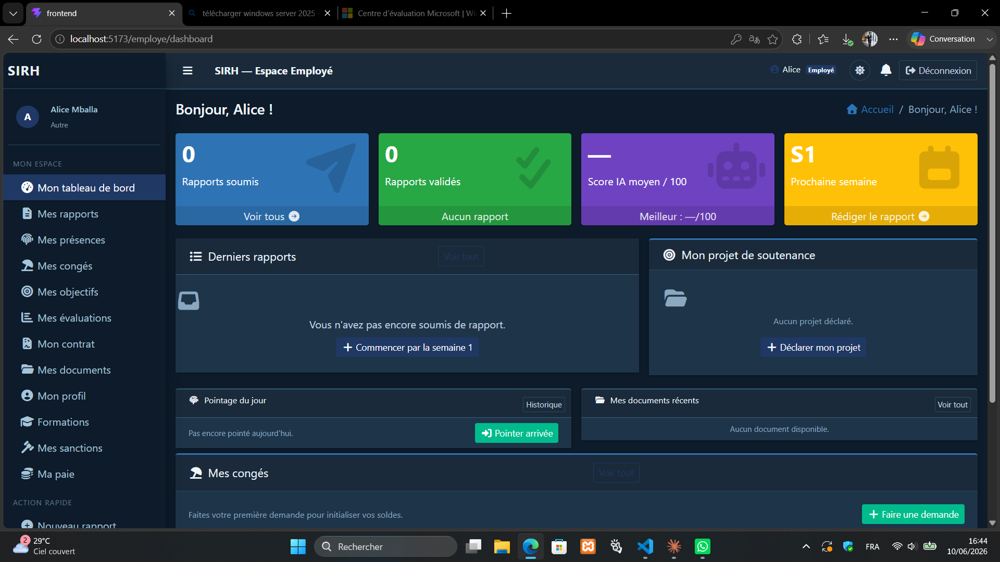 | 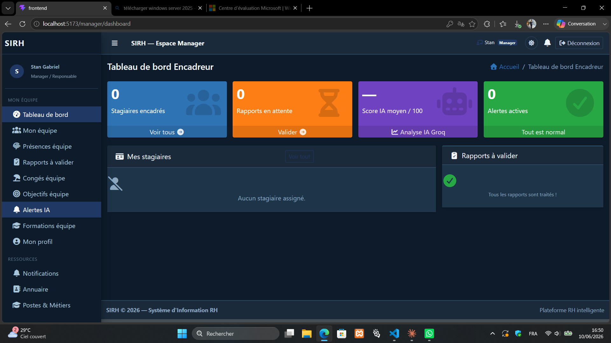 |
| Espace Employé | Espace Manager |

---

## Stack technique

| Couche | Technologie | Version |
|--------|-------------|---------|
| Backend | Django + DRF | 5.2 |
| Base de données | MySQL | 8.x |
| Connecteur BD | PyMySQL | pur Python |
| Authentification | JWT (simplejwt) | Bearer token |
| Frontend | React + Vite | 18 + 8.0 |
| UI Framework | AdminLTE + Bootstrap | 3.2 + 4 |
| État global | Zustand | — |
| Graphiques | Recharts | — |
| IA générative | Groq API / LLaMA 3.3 | llama-3.3-70b-versatile |

---

## 18 modules fonctionnels

| # | Module | Description |
|---|--------|-------------|
| 1 | Comptes | Utilisateurs avec 4 rôles (EMPLOYE / MANAGER / RH / ADMIN) |
| 2 | Entreprises | Multi-tenancy avec personnalisation (logo, couleurs) |
| 3 | Départements | Arborescence organisationnelle + postes |
| 4 | Contrats | CDI / CDD / Stage / Freelance avec alertes d'expiration |
| 5 | Congés | Demandes, workflow de validation, soldes automatiques |
| 6 | Présences | Pointages entrée/sortie, heures travaillées |
| 7 | Documents | Documents RH avec upload sécurisé |
| 8 | Paie | Bulletins avec CNPS + IRPP (fiscalité camerounaise 2024) |
| 9 | Objectifs | Objectifs SMART avec évaluations de performance |
| 10 | Recrutements | Pipeline complet + analyse IA des CV |
| 11 | Formations | Catalogue + inscriptions + compétences |
| 12 | Sanctions | Sanctions disciplinaires (accès RH/Admin) |
| 13 | Carrière | Historique des évolutions de poste |
| 14 | Rapport IA | Rapport mensuel de santé RH via Groq LLaMA 3.3 |
| 15 | Notifications | Notifications internes automatiques (7 types) |
| 16 | Annuaire | Répertoire de tous les employés |
| 17 | Rapports | Rapports d'activité hebdomadaires |
| 18 | Analyse IA | Analyses IA individuelles par rapport |

---

## Installation rapide

### Prérequis

- Python 3.11+, Node.js 18+, MySQL 8.x

### 1. Base de données

```sql
CREATE DATABASE sirh_db CHARACTER SET utf8mb4 COLLATE utf8mb4_unicode_ci;
```

### 2. Backend

```powershell
cd backend
python -m venv venv
venv\Scripts\activate
pip install -r requirements.txt
```

Créer `backend/.env` :

```env
DB_NAME=sirh_db
DB_USER=root
DB_PASSWORD=
DB_HOST=localhost
DB_PORT=3306
GROQ_API_KEY=gsk_...
SECRET_KEY=django-insecure-changeme
DEBUG=True
ALLOWED_HOSTS=localhost,127.0.0.1
CORS_ALLOWED_ORIGINS=http://localhost:5173
```

```powershell
python manage.py migrate
python manage.py runserver
```

### 3. Données de démonstration

```powershell
& "venv\Scripts\python.exe" manage.py shell -c "exec(open('fixtures/populate_demo.py', encoding='utf-8').read())"
```

### 4. Frontend

```bash
cd frontend
npm install
npm run dev
```

Application disponible sur **http://localhost:5173**

---

## Comptes de démonstration

| Rôle | Username | Mot de passe |
|------|----------|--------------|
| Responsable RH | `admin.rh` | `Demo2026!` |
| Manager | `manager.it` | `Demo2026!` |
| Employé | `alice.mballa` | `Demo2026!` |
| Employé | `paul.fopa` | `Demo2026!` |

---

## Architecture

```
gsria/
├── backend/              Django 5.2
│   ├── config/           settings.py, urls.py
│   ├── fixtures/         populate_demo.py
│   └── <18 apps>/        accounts, contrats, conges, paie, rapport_ia...
└── frontend/             React 18 + Vite
    └── src/
        ├── api/          axios.js + un fichier par module
        ├── components/   RHLayout, ManagerLayout, EmployeLayout
        ├── pages/        par rôle (rh/, manager/, employe/)
        └── store/        authStore.js (Zustand)
```

---

## Documentation

| Document | Description |
|----------|-------------|
| [docs/RAPPORT_TECHNIQUE.md](docs/RAPPORT_TECHNIQUE.md) | Rapport technique complet |
| [docs/GUIDE_INSTALLATION.md](docs/GUIDE_INSTALLATION.md) | Guide d'installation étape par étape |
| [docs/GUIDE_UTILISATEUR.md](docs/GUIDE_UTILISATEUR.md) | Guide utilisateur RH / Manager / Employé |
| [docs/SCRIPT_DEMO_SOUTENANCE.md](docs/SCRIPT_DEMO_SOUTENANCE.md) | Script de démonstration 15 min |

---

## Points techniques

- **JWT** : `EntrepriseMiddleware` s'exécute avant l'auth DRF → utiliser `request.user.entreprise` dans les vues
- **IA asynchrone** : `threading.Thread(daemon=True)` pour les appels Groq — non-bloquant
- **Paie camerounaise** : CNPS 2,8% (employé) + 7,7% (employeur), IRPP tranches progressives
- **Multi-tenancy** : champ `entreprise` FK sur tous les modèles métier

---

## Licence

Projet académique — usage éducatif. ACERFI SARL 2026.
